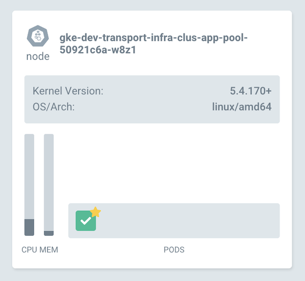
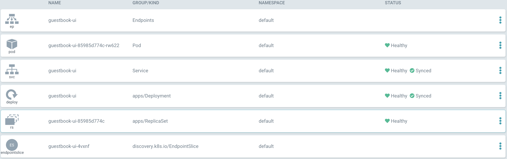

# Argocd

Argocd merupakan

# Install ArgoCD

download manifest

```
wget https://raw.githubusercontent.com/argoproj/argo-cd/stable/manifests/install.yaml
```

Create namespace `argocd`
```
$ kubectl create namespace argocd
namespace/argocd created
```

edit service untuk argocd-server agar menggunakan internal ip dan tambahkan type menjadi loadbalancer
```
apiVersion: v1
kind: Service
metadata:
+ annotations:
+   cloud.google.com/load-balancer-type: Internal
  labels:
    app.kubernetes.io/component: server
    app.kubernetes.io/name: argocd-server
    app.kubernetes.io/part-of: argocd
  name: argocd-server
spec:
  ports:
  - name: http
    port: 80
    protocol: TCP
    targetPort: 8080
  - name: https
    port: 443
    protocol: TCP
    targetPort: 8080
  selector:
    app.kubernetes.io/name: argocd-server
+ type: LoadBalancer
```

Install argocd
```
$ kubectl apply -f install.yaml -n argocd

customresourcedefinition.apiextensions.k8s.io/applications.argoproj.io created
customresourcedefinition.apiextensions.k8s.io/applicationsets.argoproj.io created
customresourcedefinition.apiextensions.k8s.io/appprojects.argoproj.io created
serviceaccount/argocd-application-controller created
serviceaccount/argocd-applicationset-controller created
serviceaccount/argocd-dex-server created
serviceaccount/argocd-notifications-controller created
serviceaccount/argocd-redis created
serviceaccount/argocd-server created
role.rbac.authorization.k8s.io/argocd-application-controller created
role.rbac.authorization.k8s.io/argocd-applicationset-controller created
role.rbac.authorization.k8s.io/argocd-dex-server created
role.rbac.authorization.k8s.io/argocd-notifications-controller created
role.rbac.authorization.k8s.io/argocd-server created
clusterrole.rbac.authorization.k8s.io/argocd-application-controller created
clusterrole.rbac.authorization.k8s.io/argocd-server created
rolebinding.rbac.authorization.k8s.io/argocd-application-controller created
rolebinding.rbac.authorization.k8s.io/argocd-applicationset-controller created
rolebinding.rbac.authorization.k8s.io/argocd-dex-server created
rolebinding.rbac.authorization.k8s.io/argocd-notifications-controller created
rolebinding.rbac.authorization.k8s.io/argocd-redis created
rolebinding.rbac.authorization.k8s.io/argocd-server created
clusterrolebinding.rbac.authorization.k8s.io/argocd-application-controller created
clusterrolebinding.rbac.authorization.k8s.io/argocd-server created
configmap/argocd-cm created
configmap/argocd-cmd-params-cm created
configmap/argocd-gpg-keys-cm created
configmap/argocd-notifications-cm created
configmap/argocd-rbac-cm created
configmap/argocd-ssh-known-hosts-cm created
configmap/argocd-tls-certs-cm created
secret/argocd-notifications-secret created
secret/argocd-secret created
service/argocd-applicationset-controller created
service/argocd-dex-server created
service/argocd-metrics created
service/argocd-notifications-controller-metrics created
service/argocd-redis created
service/argocd-repo-server created
service/argocd-server created
service/argocd-server-metrics created
deployment.apps/argocd-applicationset-controller created
deployment.apps/argocd-dex-server created
deployment.apps/argocd-notifications-controller created
deployment.apps/argocd-redis created
deployment.apps/argocd-repo-server created
deployment.apps/argocd-server created
statefulset.apps/argocd-application-controller created
networkpolicy.networking.k8s.io/argocd-application-controller-network-policy created
networkpolicy.networking.k8s.io/argocd-dex-server-network-policy created
networkpolicy.networking.k8s.io/argocd-redis-network-policy created
networkpolicy.networking.k8s.io/argocd-repo-server-network-policy created
networkpolicy.networking.k8s.io/argocd-server-network-policy created
```

6. liat service argocd
```
k get svc -n argocd
NAME                                      TYPE           CLUSTER-IP        EXTERNAL-IP   PORT(S)                      AGE
argocd-applicationset-controller          ClusterIP      192.168.182.156   <none>        7000/TCP                     2m11s
argocd-dex-server                         ClusterIP      192.168.182.136   <none>        5556/TCP,5557/TCP,5558/TCP   2m11s
argocd-metrics                            ClusterIP      192.168.182.247   <none>        8082/TCP                     2m10s
argocd-notifications-controller-metrics   ClusterIP      192.168.182.113   <none>        9001/TCP                     2m10s
argocd-redis                              ClusterIP      192.168.182.24    <none>        6379/TCP                     2m10s
argocd-repo-server                        ClusterIP      192.168.182.26    <none>        8081/TCP,8084/TCP            2m10s
argocd-server                             LoadBalancer   192.168.182.200   <pending>     80:32300/TCP,443:32565/TCP   2m10s
argocd-server-metrics                     ClusterIP      192.168.182.8     <none>        8083/TCP                     2m10s
```

7. akses argocd, tambahkan ingress
```
ingress-argocd.yaml

apiVersion: networking.k8s.io/v1beta1
kind: Ingress
metadata:
  name: argocd-server-ingress
  namespace: argocd
  annotations:
    kubernetes.io/ingress.class: nginx
    nginx.ingress.kubernetes.io/force-ssl-redirect: "false"
    nginx.ingress.kubernetes.io/ssl-passthrough: "true"
    nginx.ingress.kubernetes.io/backend-protocol: HTTPS
spec:
  rules:
  - host: argocd.ridwan-siswanto.com
    http:
      paths:
      - backend:
          serviceName: argocd-server
          servicePort: 443
        path: /

```

8. decrypt password untuk user `admin`, kemudian akses argocd.ridwan-siswanto.com
```
$ kubectl -n argocd get secret argocd-initial-admin-secret -o jsonpath="{.data.password}" | base64 -d; echo
xxxxx
```

9. login menggunakan argocd cli
```
argocd login argocd.ridwan-siswanto.com
WARN[0000] Failed to invoke grpc call. Use flag --grpc-web in grpc calls. To avoid this warning message, use flag --grpc-web.
Username: admin
Password:
'admin:login' logged in successfully
Context 'argocd.ridwan-siswanto.com' updated
```

> Installasi argocd sudah success

# Example application
An example repository containing a guestbook application is available at https://github.com/argoproj/argocd-example-apps.git to demonstrate how Argo CD works.


## Creating Apps Via CLI
deploy aplikasi menggunakan command
```
$ argocd app create guestbook --repo https://github.com/argoproj/argocd-example-apps.git --path guestbook --dest-server https://kubernetes.default.svc --dest-namespace default

WARN[0000] Failed to invoke grpc call. Use flag --grpc-web in grpc calls. To avoid this warning message, use flag --grpc-web.
application 'guestbook' created
```

list app argocd
```
$ argocd app list

WARN[0000] Failed to invoke grpc call. Use flag --grpc-web in grpc calls. To avoid this warning message, use flag --grpc-web.
NAME       CLUSTER                         NAMESPACE  PROJECT  STATUS     HEALTH   SYNCPOLICY  CONDITIONS  REPO                                                 PATH       TARGET
guestbook  https://kubernetes.default.svc  default    default  OutOfSync  Missing  <none>      <none>      https://github.com/argoproj/argocd-example-apps.git  guestbook
```

get app argocd
```
$ argocd app get guestbook

Name:               guestbook
Project:            default
Server:             https://kubernetes.default.svc
Namespace:          default
URL:                https://argocd.ridwan-siswanto.com/applications/guestbook
Repo:               https://github.com/argoproj/argocd-example-apps.git
Target:
Path:               guestbook
SyncWindow:         Sync Allowed
Sync Policy:        <none>
Sync Status:        OutOfSync from  (53e28ff)
Health Status:      Missing

GROUP  KIND        NAMESPACE  NAME          STATUS     HEALTH   HOOK  MESSAGE
       Service     default    guestbook-ui  OutOfSync  Missing
apps   Deployment  default    guestbook-ui  OutOfSync  Missing
```

## Sync application

with cli
```
$ argocd app sync guestbook

TIMESTAMP                  GROUP        KIND   NAMESPACE                  NAME    STATUS    HEALTH        HOOK  MESSAGE
2022-04-16T12:16:11+07:00            Service     default          guestbook-ui  OutOfSync  Missing
2022-04-16T12:16:11+07:00   apps  Deployment     default          guestbook-ui  OutOfSync  Missing
2022-04-16T12:16:11+07:00            Service     default          guestbook-ui    Synced  Healthy
2022-04-16T12:16:11+07:00            Service     default          guestbook-ui    Synced   Healthy              service/guestbook-ui created
2022-04-16T12:16:11+07:00   apps  Deployment     default          guestbook-ui  OutOfSync  Missing              deployment.apps/guestbook-ui created
2022-04-16T12:16:12+07:00   apps  Deployment     default          guestbook-ui    Synced  Progressing              deployment.apps/guestbook-ui created

Name:               guestbook
Project:            default
Server:             https://kubernetes.default.svc
Namespace:          default
URL:                https://argocd.ridwan-siswanto.com/applications/guestbook
Repo:               https://github.com/argoproj/argocd-example-apps.git
Target:
Path:               guestbook
SyncWindow:         Sync Allowed
Sync Policy:        <none>
Sync Status:        Synced to  (53e28ff)
Health Status:      Progressing

Operation:          Sync
Sync Revision:      53e28ff20cc530b9ada2173fbbd64d48338583ba
Phase:              Succeeded
Start:              2022-04-16 12:16:11 +0700 WIB
Finished:           2022-04-16 12:16:12 +0700 WIB
Duration:           1s
Message:            successfully synced (all tasks run)

GROUP  KIND        NAMESPACE  NAME          STATUS  HEALTH       HOOK  MESSAGE
       Service     default    guestbook-ui  Synced  Healthy            service/guestbook-ui created
apps   Deployment  default    guestbook-ui  Synced  Progressing        deployment.apps/guestbook-ui created

```

get application
```
Name:               guestbook
Project:            default
Server:             https://kubernetes.default.svc
Namespace:          default
URL:                https://argocd.ridwan-siswanto.com/applications/guestbook
Repo:               https://github.com/argoproj/argocd-example-apps.git
Target:
Path:               guestbook
SyncWindow:         Sync Allowed
Sync Policy:        <none>
Sync Status:        Synced to  (53e28ff)
Health Status:      Healthy

GROUP  KIND        NAMESPACE  NAME          STATUS  HEALTH   HOOK  MESSAGE
       Service     default    guestbook-ui  Synced  Healthy        service/guestbook-ui created
apps   Deployment  default    guestbook-ui  Synced  Healthy        deployment.apps/guestbook-ui created
```


kita bisa ganti detail view menjadi pernodes




dan ini menjadi list


Referensi:

```https://stackoverflow.com/questions/49856754/nginx-ingress-too-many-redirects-when-force-ssl-is-enabled```